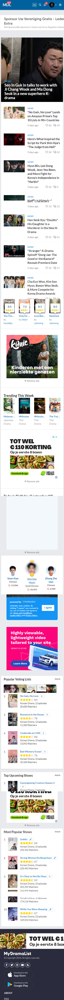
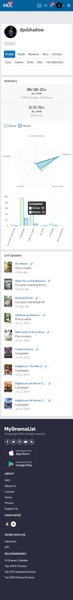

# Procesverslag
Markdown is een simpele manier om HTML te schrijven.  
Markdown cheat cheet: [Hulp bij het schrijven van Markdown](https://github.com/adam-p/markdown-here/wiki/Markdown-Cheatsheet).

Nb. De standaardstructuur en de spartaanse opmaak van de README.md zijn helemaal prima. Het gaat om de inhoud van je procesverslag. Besteedt de tijd voor pracht en praal aan je website.

Nb. Door *open* toe te voegen aan een *details* element kun je deze standaard open zetten. Fijn om dat steeds voor de relevante stuk(ken) te doen.

## Jij

  
uitwerken voor kick-off werkgroep

  ### Auteur:
  Diya Leda

  #### Je startniveau:
  Blauw

  #### Je focus:
  Surface Plane
 

## Je website

  
uitwerken voor kick-off werkgroep

  ### Je opdracht:
  https://mydramalist.com/ 

  #### Screenshot(s) van de eerste pagina (small screen): Home pagina
  

  #### Screenshot(s) van de tweede pagina (small screen): Profiel pagina
  
 

## Toegankelijkheidstest 1/2 (week 1)

  
uitwerken na test in 2e werkgroep

  ### Bevindingen
  Content
  <ul>
    <li>In het menu staan dingen dubbel. </li>
    <li>Op de Profiel pagina bevat 1 afkorting, Recs-> Recommendations </li>
    <li>Afbeeldingen in de News blok hebben geen omschrijving. </li>
  </ul>

  Global code
  <ul>
    <li>De lang-element is heel kort, geen idee wat dat betekend.</li>
    <li>Knoppen hebben geen toegankelijke naam.</li>
    <li>Img geen Alt-kenmerk of geen goeie naam.</li>
    <li>frame-element hebben geen titel.</li>
    <li>Links hebben geen herkenbare naam.</li>
    <li>Contrast voor- en achtergrond zijn niet goed.</li>
    <li>Tikdoelen zijn niet groot genoeg of er is niet voldoende lege ruimte.</li>
    <li>Kopelementen worden niet weergeven in aflopende volgorde. h1-> h2-> h6</li>
  </ul>

  Keyboard
  <ul>
    <li>Toen ik een keer op enter drukte ging de profiel naviagatie open. Maar na het refrence werkte het niet meer. 
        Ik kon wel zeker naar beneden en boven</li>
  </ul>

  Mobile and touch
  <ul>
    <li>Ik kan het niet rond draaien, wel in en uit zoomen.</li>
    <li>Het knopje om shows toe te voegen zijn erg klein. Ik klik dan soms mis op de titel (die leid dan naar de show pagina).</li>
    <li>De licht en donker knop in de footer(staat dubble) is moeilijk te klikken. Kan ook zijn dat het heel langzaam is qua reactie.</li>
  </ul>

Headings
  <ul>
    <li>De h1 is op de homepagina hidden.</li>
    <li>Kopelementen worden niet weergeven in aflopende volgorde. h1-> h2-> h6</li>
  </ul>

  List
  <ul>
    <li>Op de homepagina maken ze niet gebruik van een list (zover ik heb gezien).</li>
  </ul>

  Images
  <ul>
    <li>Img's bij News hebben ze geen naam.</li>
  </ul>

  Controles
  <ul>
    <li>Allen de navigatie maakt gebruik van een hover. In de footer zijn de links niet duidelijk.</li>
    <li>Geen skip link.</li>
    <li>Geen button's maar a-element.</li>
  </ul>

Appearance
  <ul>
    <li>De tekst wordt niet groter, allen de website (geen idee of dat het zo werkt of dat het fout gaat).</li>
  </ul>

Color contrast
  <ul>
    <li>Voor de normale tekst is het qua grote of kleur niet altijd goed. De kleuren zijn op sommige plekken blauw of grijs en
        die zijn niet even duidelijk als de zwart (donkere blauw?).</li>
  </ul>

## Breakdownschets (week 1)

  
uitwerken na afloop 3e werkgroep

  ### de hele pagina: 
  

  ### dynamisch deel (bijv menu): 
  

  ### wellicht nog een dynamisch deel (bijv filter): 
  

## Voortgang 1 (week 2)

  
uitwerken voor 1e voortgang

  ### Stand van zaken
  hier dit ging goed & dit was lastig (neem ook screenshots op van delen van je website en code)

  ### Agenda voor meeting
  samen met je groepje opstellen

  | student 1      | student 2          | student 3    | student 4        |
  | ---            | ---                | ---          | ---              |
  | dit bespreken  | en dit             | en ik dit    | en dan ik dat    |
  | en dat ook nog | dit als er tijd is | nog een punt | dit wil ik zeker |
  | ...            | ...                | ...          | ...              |

  ### Verslag van meeting
  hier na afloop snel de uitkomsten van de meeting vastleggen

  - punt 1
  - punt 2
  - nog een punt
  - ...

## Voortgang 2 (week 3)

  
uitwerken voor 2e voortgang

  ### Stand van zaken
  hier dit ging goed & dit was lastig (neem ook screenshots op van delen van je website en code)

  ### Agenda voor meeting
  samen met je groepje opstellen

  | student 1      | student 2          | student 3    | student 4        |
  | ---            | ---                | ---          | ---              |
  | dit bespreken  | en dit             | en ik dit    | en dan ik dat    |
  | en dat ook nog | dit als er tijd is | nog een punt | dit wil ik zeker |
  | ...            | ...                | ...          | ...              |

  ### Verslag van meeting
  hier na afloop snel de uitkomsten van de meeting vastleggen

  - punt 1
  - punt 2
  - nog een punt
- ...

## Toegankelijkheidstest 2/2 (week 4)

  
uitwerken na test in 9e werkgroep

  ### Bevindingen
  Lijst met je bevindingen die in de test naar voren kwamen (geef ook aan wat er verbeterd is):

## Voortgang 3 (week 4)

  
uitwerken voor 3e voortgang

  ### Stand van zaken
  hier dit ging goed & dit was lastig (neem ook screenshots op van delen van je website en code)

  ### Agenda voor meeting
  samen met je groepje opstellen

  | student 1      | student 2          | student 3    | student 4        |
  | ---            | ---                | ---          | ---              |
  | dit bespreken  | en dit             | en ik dit    | en dan ik dat    |
  | en dat ook nog | dit als er tijd is | nog een punt | dit wil ik zeker |
  | ...            | ...                | ...          | ...              |

  ### Verslag van meeting
  hier na afloop snel de uitkomsten van de meeting vastleggen

  - punt 1
  - punt 2
  - nog een punt
  - ...

## Eindgesprek (week 5)

  
uitwerken voor eindgesprek

  ### Je uitkomst - karakteristiek screenshots:
  

  ### Dit ging goed/Heb ik geleerd: 
  Korte omschrijving met plaatjes

  

  ### Dit was lastig/Is niet gelukt:
  Korte omschrijving met plaatjes

  

## Bronnenlijst

  
continu bijhouden terwijl je werkt

  Nb. Wees specifiek ('css-tricks' als bron is bijv. niet specifiek genoeg). 
  Nb. ChatGpT en andere AI horen er ook bij.
  Nb. Vermeld de bronnen ook in je code.

  1. bron 1
  2. bron 2
  3. ...

