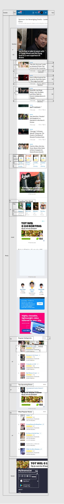
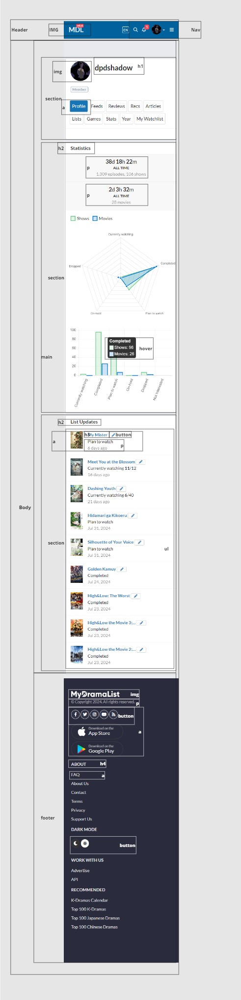
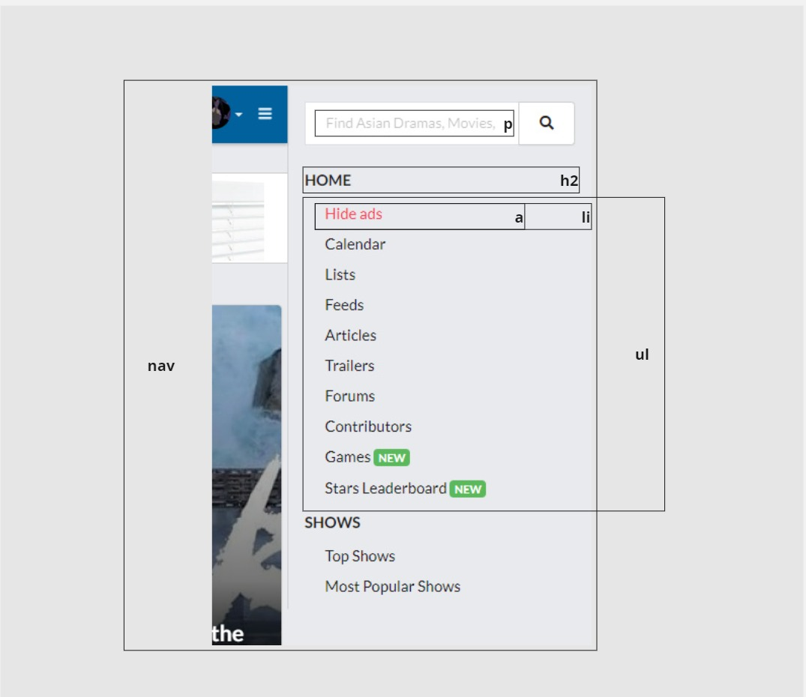
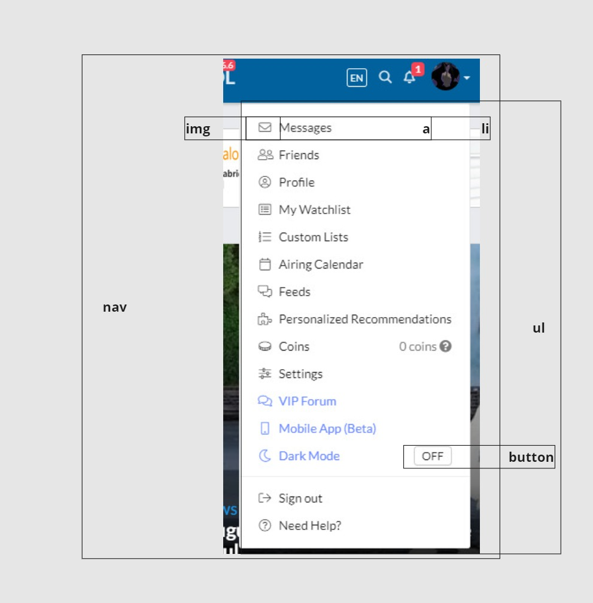
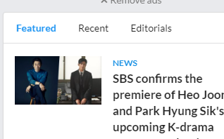
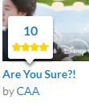
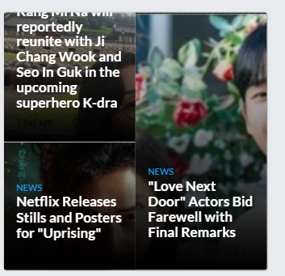
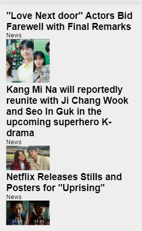
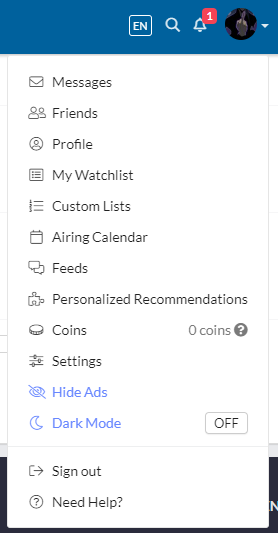

# Procesverslag
Markdown is een simpele manier om HTML te schrijven.  
Markdown cheat cheet: [Hulp bij het schrijven van Markdown](https://github.com/adam-p/markdown-here/wiki/Markdown-Cheatsheet).

Nb. De standaardstructuur en de spartaanse opmaak van de README.md zijn helemaal prima. Het gaat om de inhoud van je procesverslag. Besteedt de tijd voor pracht en praal aan je website.

Nb. Door *open* toe te voegen aan een *details* element kun je deze standaard open zetten. Fijn om dat steeds voor de relevante stuk(ken) te doen.

## Jij

  
uitwerken voor kick-off werkgroep

  ### Auteur:
  Diya Leda

  #### Je startniveau:
  Blauw

  #### Je focus:
  Surface Plane
 

## Je website

  
uitwerken voor kick-off werkgroep

  ### Je opdracht:
  https://mydramalist.com/ 

  #### Screenshot(s) van de eerste pagina (small screen): Home pagina
  

  #### Screenshot(s) van de tweede pagina (small screen): Profiel pagina
  
 

## Toegankelijkheidstest 1/2 (week 1)

  
uitwerken na test in 2e werkgroep

  ### Bevindingen
  Content
  <ul>
    <li>In het menu staan dingen dubbel. </li>
    <li>Op de Profiel pagina bevat 1 afkorting, Recs-> Recommendations </li>
    <li>Afbeeldingen in de News blok hebben geen omschrijving. </li>
  </ul>

  Global code
  <ul>
    <li>De lang-element is heel kort, geen idee wat dat betekend.</li>
    <li>Knoppen hebben geen toegankelijke naam.</li>
    <li>Img geen Alt-kenmerk of geen goeie naam.</li>
    <li>frame-element hebben geen titel.</li>
    <li>Links hebben geen herkenbare naam.</li>
    <li>Contrast voor- en achtergrond zijn niet goed.</li>
    <li>Tikdoelen zijn niet groot genoeg of er is niet voldoende lege ruimte.</li>
    <li>Kopelementen worden niet weergeven in aflopende volgorde. h1-> h2-> h6</li>
  </ul>

  Keyboard
  <ul>
    <li>Toen ik een keer op enter drukte ging de profiel naviagatie open. Maar na het refrence werkte het niet meer. 
        Ik kon wel zeker naar beneden en boven</li>
  </ul>

  Mobile and touch
  <ul>
    <li>Ik kan het niet rond draaien, wel in en uit zoomen.</li>
    <li>Het knopje om shows toe te voegen zijn erg klein. Ik klik dan soms mis op de titel (die leid dan naar de show pagina).</li>
    <li>De licht en donker knop in de footer(staat dubble) is moeilijk te klikken. Kan ook zijn dat het heel langzaam is qua reactie.</li>
  </ul>

Headings
  <ul>
    <li>De h1 is op de homepagina hidden.</li>
    <li>Kopelementen worden niet weergeven in aflopende volgorde. h1-> h2-> h6</li>
  </ul>

  List
  <ul>
    <li>Op de homepagina maken ze niet gebruik van een list (zover ik heb gezien).</li>
  </ul>

  Images
  <ul>
    <li>Img's bij News hebben ze geen naam.</li>
  </ul>

  Controles
  <ul>
    <li>Allen de navigatie maakt gebruik van een hover. In de footer zijn de links niet duidelijk.</li>
    <li>Geen skip link.</li>
    <li>Geen button's maar a-element.</li>
  </ul>

Appearance
  <ul>
    <li>De tekst wordt niet groter, allen de website (geen idee of dat het zo werkt of dat het fout gaat).</li>
  </ul>

Color contrast
  <ul>
    <li>Voor de normale tekst is het qua grote of kleur niet altijd goed. De kleuren zijn op sommige plekken blauw of grijs en
        die zijn niet even duidelijk als de zwart (donkere blauw?).</li>
  </ul>

## Breakdownschets (week 1)

  
uitwerken na afloop 3e werkgroep

  ### de hele Home pagina: 
  

  ### de hele Profiel pagina: 
  

  ### dynamisch deel (menu): 
  
  

## Voortgang 1 (week 2)

  
uitwerken voor 1e voortgang

  ### Stand van zaken
  Voor het eerste voortgangsgesprek heb ik aan de homepagina gewerkt. Voor de eerste les heb ik wel alle sections in de HTML gezet, anders leek het zo weinig. 

  Sommige sections lijken veel op elkaar, dus die kan ik dan weghalen. 

  #### Section switch
  

  #### Rating
   

  ### Agenda voor meeting
  samen met je groepje opstellen

  |     Diya        | Giulietta          | Keysha         | Thi                  |
  | ---             | ---                | ---            | ---                  |
  | section switch  | form               | Section switch | Slide show           |
  | Rating          | Pagina veranderd   | List           | span before:: after::|
  | ...             | ...                | ...            | ...                  |

  ### Verslag van meeting
  hier na afloop snel de uitkomsten van de meeting vastleggen

  - Section switch-> Hoeft niet te maken. Maar ik wil het wel, omdat het er gewoon  interessant lijkt en ik wil wel nieuwe dingen leren.
  - Rating-> gewoon faken
  - Hover werkte niet-> Hover werkt niet op telefoon formaat. ☹
    - Hover image, transition, opacity
  - More '>>'->  aanpassen, niet de driekhoek van het toetsenbord gebruiken. 
  - Grid maken voor je lijst of voor je lijst.
  - h2::before{}
  - <h1></h1>

## Voortgang 2 (week 3)

  
uitwerken voor 2e voortgang

  #### Carousal
  Hoe het eruit moet zien:
   
  Wat ik nu heb:
   
    - Ik heb aan Chatgpt gevraagd hoe ik dit zou maken, heb ik de divs veranderd naar section's en andere dingen. En nu wilt hij niet helemaal werken. 
  - Ook vroeg ik mij af of we een <strong>a om de article<strong> kunnen zetten of dat ik een ul, en dan a als article. Want dat heb ik bij andere stukken zo gedaan.

  #### Nth-last-of-child
  
  
  -Ik heb mijn code in een section gezet, die section benoemt in de css met behulp van nth-last-of-child. Maar hij wilt niks doen. Bij section 4 wilt hij het wel doen, maar bij de rest van de sections niet en ik heb geen idee waarom. 

  ### Agenda voor meeting
  samen met je groepje opstellen

  |     Diya          | Giulietta          | Keysha                    | Thi           |
  | ---               | ---                | ---                       | ---           |
  |   carousel        |  video background  | extra ruimte in de nav    | Navigatie x   |
  | nth-last-of-child | nav sticky         | kleur veranderen svg      | img size      |
  | ...               | ...                | ...                       | ...           |

  ### Verslag van meeting
  hier na afloop snel de uitkomsten van de meeting vastleggen

  - Font downloaden op google. Reset refresh. Inspect-> Network-> Font.
  - nth-of-type telt van 1t/m verder
  - Mag twee navs
  - position: fixed, om elementen vast te zetten. top: 0, right:0, left:0. 
  - Sluitmenu naar rechts. 
  - justify-self:end;

  - Lelijke manier icoon veranderen: filter: invert(1);. Van wit naar zwart of zwart naar wit. 
  - Mooie manier icoon veranderen: svg openen in studio code, de link pakken en in je html zetten. svg benoemen in de CSS en kleur veranderen

## Toegankelijkheidstest 2/2 (week 4)

  
uitwerken na test in 9e werkgroep

  ### Verbeteringen
  Lijst met je bevindingen die in de test naar voren kwamen (geef ook aan wat er verbeterd is):

  ### Wat ik nog moet verbeteren
  - Hij zie de h3 binnen de a niet.

## Voortgang 3 (week 4)

  
uitwerken voor 3e voortgang

  ### Tweede menu
  
  Ik heb nog problemen met mijn nav. Maar daarbuiten heb ik nog een menu maar ik heb geen idee hoe ik die
  moet toevoegen. Ik heb al online gekeken, maar met de javascript geeft heb mij gewoon hoofdpijn. 

  ### Speciale button
  
  In mijn footer heb ik meerderekeren deze knop, maar ik heb ook echt geen idee hoe ik deze moet maken. Of hoe ze uberhaupt heten. 
  
  Als je er overheen hovered veranderd de kleur. Animatie???

  ### Agenda voor meeting
  samen met je groepje opstellen

  |     Diya          | Giulietta              | Keysha  | Thi           |
  | ---               | ---                    | ---     | ---           |
  |   andere menu     |  img + tekst stijlen   |         | tekst op plaatje              |
  | speciale button   |                        |         | filter tabs              |
  | ...               | ...                    | ...     | ...           |

  ### Verslag van meeting
  hier na afloop snel de uitkomsten van de meeting vastleggen

  - display flex 
  - flex wrap
  - nog een punt
  - afbeelding grijze filter over heen-> ::before (even video zoeken)
  - Special button, de tekst wegghalen daar de svg in doen en vormgeven. 

## Eindgesprek (week 5)

  
uitwerken voor eindgesprek

  ### Je uitkomst - karakteristiek screenshots:
  

  ### Dit ging goed/Heb ik geleerd: 
  Korte omschrijving met plaatjes

  

  ### Dit was lastig/Is niet gelukt:
  Korte omschrijving met plaatjes

  

## Bronnenlijst

  
continu bijhouden terwijl je werkt

  Nb. Wees specifiek ('css-tricks' als bron is bijv. niet specifiek genoeg). 
  Nb. ChatGpT en andere AI horen er ook bij.
  Nb. Vermeld de bronnen ook in je code.

  1. bron 1
  2. bron 2
  3. ...

